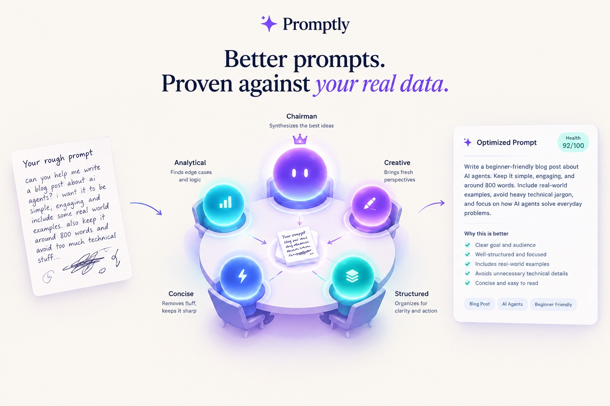

# Promptly — AI Prompt Optimization Platform



Promptly turns rough prompts into production-grade ones. The core **multi-model council pipeline** has four LLMs independently rewrite your prompt, blind-review each other's proposals, and a chairman model synthesises the best result. Alongside it are research-grade optimizers — **GEPA** for domain prompts and **SkillOpt** for agent skills — plus cross-model prompt transfer, analysis, and a full admin console.

---

## Features

### Core — Prompt Optimization
- **Council pipeline** — 4 models optimize in parallel (Round 1), blind peer-review all proposals (Round 2), chairman synthesizes the winner (Round 3)
- **Guardrails & intent classifier** — rejects non-prompt input before any optimization runs
- **Performance gate** — detects already-optimized prompts and short-circuits, using fewer tokens
- **Iterative refinement** — quality gate can trigger additional passes when the first synthesis isn't strong enough
- **Structured reasoning** — every optimization explains what changed, why, and what was preserved
- **Feedback loop** — submit feedback on any result to refine it further in the same session
- **Version history** — every optimization is saved as a versioned prompt family; compare across versions
- **Prompt categories** — tag prompts by category (code generation, analysis, writing, etc.) to apply specialized optimization guidance

### Prompt Analysis
- **Health score** — 8-dimension quality scoring (role/persona, goal clarity, context, output format, examples, guardrails, tone, conciseness)
- **Advisory** — strengths, weaknesses, and improvement suggestions without running a full optimization

### Domain Prompts (with GEPA)
- Upload a PDF of domain knowledge to build a specialized dataset
- Generate Q&A pairs from the document, then optimize a prompt against them
- **GEPA — Reflective Prompt Evolution** ([arXiv:2507.19457](https://arxiv.org/abs/2507.19457)): Pareto-frontier candidate sampling, reflective mutation from execution traces, and minibatch gating. Live state goes to Redis so the UI can show the score matrix while the run is in progress
- Run history per user; datasets and PDFs stored in MinIO, with optional sharing

### SkillOpt — Agent Skill Optimization
- Text-space optimizer for agent skills ([arXiv:2605.23904](https://arxiv.org/abs/2605.23904))
- Per-epoch loop: rollout → partition successes/failures → reflect (ADD/DELETE/REPLACE edits) → merge under an LR budget → gate on a held-out selection set → epoch-end meta update
- 3-way train / selection / test split (min. 10 examples), with a score cache keyed by skill hash and a protected region in the skill that edits never touch
- Low / medium / high effort tiers

### Prompt Bridge
- Transfer a prompt optimized for one LLM (e.g. GPT-4o) to work well on another (e.g. Claude Sonnet)
- Learns a style-transfer mapping from calibrated example pairs, then applies it to your prompt
- Reuses a saved mapping for a model pair, or runs a full re-extraction
- Per-model usage breakdown with live OpenRouter pricing

### Library
- **Versions** — browse and restore any version of any prompt family
- **Prompt Library** — saved/favorited prompts (prompt store)
- **Prompt Project** — organize prompts into projects
- **Prompt Media** — library of ready-to-use prompts (coming soon)
- **History** — full session history with sidebar search

### Account
- **Token-based billing** — every user starts with **3,000,000 tokens**; each job is charged for the LLM tokens it actually used, and only once it completes. A small overdraft (down to −15,000) lets an in-flight run finish. New jobs return **HTTP 402** once the balance is exhausted. Only admins can top up tokens.
- API key management for programmatic access (`qac_`-prefixed keys)
- Settings and billing pages

### Admin Console (`is_admin` users only)
- **Admin Panel** (`/admin`) — Overview KPIs, Users (token balances, bulk top-ups), Rate Limits (live Redis counters), Errors (GlitchTip), Health (DB / Redis / Celery), Jobs, API Keys, Audit Log, User Activity, OpenRouter spend
- **View** (`/admin/view`) — analytics for Platform (engagement, logins, user metrics) and Agents (Optimizer, SkillOpt, Domain, Bridge), plus Domain Files
- **Developer Metrics** — per-endpoint latency and errors from the API request-log middleware, and Sentry/GlitchTip issue tracking with AI-suggested fixes
- Every admin action is written to the audit log

---

## Architecture

```
Browser → Next.js (:3000)
              ↓ axios (NEXT_PUBLIC_API_URL)
         FastAPI (:8000)  →  202 { job_id }
              ↓ Celery task dispatch
         Redis (broker)
              ↓ Celery Worker → LangGraph → OpenRouter LLMs
              ↓ writes result + SSE progress events to Redis
         FastAPI GET /chat/jobs/{id}/stream ← frontend SSE stream
                                            ← falls back to polling every 1 s
```

`POST /api/v1/chat/` never blocks — it returns `job_id` immediately. The LangGraph pipeline runs in the Celery worker. Without the worker running, all optimize requests will hang in `queued` state.

---

## Tech Stack

| Layer | Technology |
|-------|------------|
| Frontend | Next.js 14 (App Router), TypeScript strict, Tailwind CSS, shadcn/ui, TanStack Query v5, Zustand |
| Backend | FastAPI, Python 3.12, SQLAlchemy 2.0 (async + asyncpg), Alembic |
| Queue | Celery + Redis |
| AI Pipeline | LangGraph, OpenRouter (multi-model council) |
| Auth | Supabase (JWT via JWKS) + `qac_` API keys |
| Database | PostgreSQL 16 (pgvector) |
| Object Storage | MinIO (domain prompt PDFs and datasets) |
| Error Tracking | Sentry SDK → self-hosted GlitchTip |
| Testing | pytest (unit + integration), Playwright (e2e) |
| Code Quality | Ruff, MyPy strict, ESLint, pre-commit hooks |

---

## Quick Start

### Prerequisites
- Docker (for PostgreSQL, Redis, MinIO)
- Python 3.12 + [uv](https://github.com/astral-sh/uv)
- Node.js 18+

### 1. Backend

```bash
cd qa-chatbot
cp .env.example .env       # fill in OPENROUTER_API_KEY and other vars
make install               # uv sync --all-extras
make infra                 # start postgres + redis + minio (+ GlitchTip) containers
make migrate               # run alembic migrations
make dev                   # uvicorn on :8000
```

### 2. Celery Worker (required — separate terminal)

```bash
cd qa-chatbot && make worker
```

### 3. Frontend

```bash
cd frontend
npm install
npm run dev                # Next.js on :3000
```

Create `frontend/.env.local` with `NEXT_PUBLIC_API_URL`, `NEXT_PUBLIC_SUPABASE_URL`, and `NEXT_PUBLIC_SUPABASE_ANON_KEY` (see the table below).

Visit `http://localhost:3000` · API docs at `http://localhost:8000/docs`

---

## Environment Variables

### Backend (`qa-chatbot/.env`)

| Variable | Required | Description |
|----------|----------|-------------|
| `OPENROUTER_API_KEY` | ✅ | Routes all LLM calls |
| `DATABASE_URL` | ✅ | Async postgres (`postgresql+asyncpg://...`) |
| `REDIS_URL` | ✅ | Celery broker/backend + job state cache |
| `SUPABASE_URL` | ✅ | Supabase project URL (JWT verification via JWKS) |
| `SUPABASE_ANON_KEY` | ✅ | Supabase anon key |
| `SUPABASE_SERVICE_ROLE_KEY` | ✅ | Supabase service-role key |
| `SUPABASE_JWT_SECRET` | ✅ | HS256 fallback for token verification |
| `COUNCIL_MODELS` | — | Override 4 model slugs (comma-separated); index order maps to the 4 optimization strategies |
| `DEFAULT_MODEL` | — | Chairman/synthesizer model slug |
| `MINIO_ENDPOINT_URL` | — | Default: `http://localhost:9000` |
| `MINIO_ACCESS_KEY` | — | MinIO credentials |
| `MINIO_SECRET_KEY` | — | MinIO credentials |
| `MINIO_BUCKET_NAME` | — | Default: `promptly` |
| `SENTRY_DSN` | — | Error reporting DSN (GlitchTip is Sentry-compatible); disabled when empty |
| `GLITCHTIP_API_URL` / `GLITCHTIP_API_TOKEN` | — | Lets the admin Errors tab read issues |
| `RATE_LIMIT_REQUESTS` / `RATE_LIMIT_WINDOW_SECONDS` | — | Global rate limit (default 100 / 60 s) |

### Frontend (`frontend/.env.local`)

| Variable | Required | Description |
|----------|----------|-------------|
| `NEXT_PUBLIC_API_URL` | ✅ | Backend base URL |
| `NEXT_PUBLIC_SUPABASE_URL` | ✅ | Supabase project URL (browser auth) |
| `NEXT_PUBLIC_SUPABASE_ANON_KEY` | ✅ | Supabase anon key (browser auth) |
| `NEXT_PUBLIC_APP_URL` | — | Public frontend URL (auth redirects) |
| `NEXT_PUBLIC_GLITCHTIP_URL` | — | Links from the admin Errors tab to GlitchTip |

---

## Project Structure

```
promptly/
├── qa-chatbot/                   # FastAPI backend
│   ├── src/promptly/             # modular monolith — see docs/adr/0001-backend-architecture.md
│   │   ├── optimize/             # Flagship "optimize" slice (chat api + service + worker)
│   │   ├── domain_prompt/        # Domain Prompts + GEPA optimizer
│   │   ├── skill_opt/            # SkillOpt agent-skill optimizer
│   │   ├── prompt_bridge/        # Prompt Bridge (cross-model style transfer)
│   │   ├── admin/                # Admin API + services (analytics, audit, OpenRouter)
│   │   ├── graph/                # Shared LangGraph engine — nodes, prompts, state, checkpointer
│   │   ├── llm/                  # Shared LLM client (OpenRouter)
│   │   ├── api/v1/               # Thin-layer routers (prompts, favorites, categories, users, api keys, stats, ...)
│   │   ├── services/ repositories/ models/ schemas/  # Thin-layer CRUD
│   │   ├── migrations/           # Alembic migrations
│   │   └── core/ config/ db/ workers/  # Shared kernel (auth, settings, sessions, Celery)
│   └── tests/                    # unit/ + integration/
└── frontend/                     # Next.js frontend
    ├── e2e/                      # Playwright specs
    └── src/
        ├── app/(dashboard)/      # Dashboard routes
        │   ├── optimize/         # Main optimization chat page
        │   ├── domain-prompts/   # Domain Prompts + GEPA UI
        │   ├── skill-opt/        # SkillOpt UI
        │   ├── bridge/           # Prompt Bridge UI
        │   ├── analyze/          # Health score + advisory
        │   ├── versions/ prompt-library/ prompt-project/ prompts-media/ history/
        │   ├── settings/ billing/
        │   └── admin/            # Admin Panel + /admin/view analytics
        ├── components/           # optimize/, admin/, layout/, ...
        ├── hooks/                # TanStack Query hooks, SSE job stream
        ├── stores/               # Zustand (auth, job state)
        └── types/api.ts          # TypeScript interfaces mirroring backend schemas
```

---

## Controlling LLM Behavior

System prompts are Python string constants in each slice's `prompts/` package. Edit them and restart the API and worker.

| Location | Controls |
|----------|----------|
| `graph/prompts/council_optimizer.py` | How all 4 council models optimize prompts |
| `graph/prompts/critic.py` | How models blind-review each other's proposals |
| `graph/prompts/synthesize_best.py` | How the chairman picks and merges the best result |
| `graph/prompts/intent_classifier.py` | What gets rejected vs. passed to the optimizer |
| `graph/prompts/performance_gate.py` | When an already-good prompt short-circuits |
| `graph/prompts/category_guidance.py` | Per-category optimization guidance |
| `graph/prompts/prompt_health_score.py` | The 8 scoring dimensions and their weights |
| `graph/prompts/prompt_advisory.py` | Strengths/weaknesses analysis format |
| `domain_prompt/prompts/` | Dataset builder, domain optimizer, GEPA reflection/scoring |
| `skill_opt/prompts/system.py` | SkillOpt executor, analyst, and merge prompts |
| `prompt_bridge/prompts/` | Mapping extraction and transfer |

All paths are relative to `qa-chatbot/src/promptly/`.

---

## Development Commands

```bash
# Backend
cd qa-chatbot
make lint        # ruff check
make format      # ruff format
make typecheck   # mypy --strict
make test        # pytest with coverage (test-unit / test-api for subsets)
make check       # lint + format + typecheck in one go
make migration name="..."   # autogenerate an Alembic migration
make rollback    # downgrade one migration

# Frontend
cd frontend
npm run lint     # eslint
npm run build    # type-check + production build
npm run test:e2e # Playwright end-to-end tests
```

---

## Documentation

- **Backend architecture (ADR):** [`docs/adr/0001-backend-architecture.md`](docs/adr/0001-backend-architecture.md) — the modular-monolith rule.
- **Product reference:** [`docs/PRODUCT_REFERENCE.md`](docs/PRODUCT_REFERENCE.md)
- **Deployment runbook:** [`docs/deployment.md`](docs/deployment.md) — Docker Compose build / migrate / deploy / rollback.
- **Per-app guides:** [`qa-chatbot/README.md`](qa-chatbot/README.md) · [`qa-chatbot/CLAUDE.md`](qa-chatbot/CLAUDE.md) (backend) · [`frontend/CLAUDE.md`](frontend/CLAUDE.md).
- **Deferred work:** [`docs/superpowers/notes/2026-06-03-deferred-work.md`](docs/superpowers/notes/2026-06-03-deferred-work.md).

## Contributing

See [CONTRIBUTING.md](CONTRIBUTING.md).

## Security

See [SECURITY.md](SECURITY.md) for the vulnerability disclosure policy.

## License

[MIT](LICENSE)
